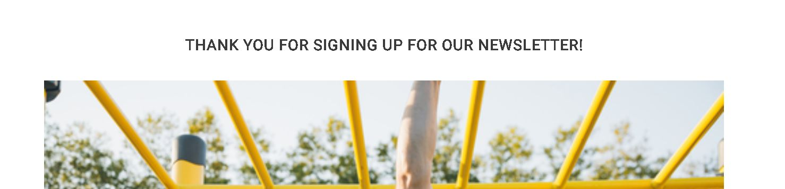

# How To Calisthenic
How To Calisthenic is a website dedicated to folks who are interested in learning more about calisthenics and getting started with it. There are countless videos available, the majority of which highlight the sport's difficult and glamorous aspects. I wanted to acquire the basics for a beginning, as well as some solid people to follow in the community. So that they will have the best chance of being successful with calisthenics.

# Live Site
[How To Calisthenic](https://stealthy20.github.io/how-to-calisthenic/)
# Repository
[GitHub](https://github.com/Stealthy20/how-to-calisthenic)
# Features
**This site is contains following content**
- Landing page with introduction to the site and calisthenic
- Get started page
- Inspiration page
- Form to sign up for a newsletter
- Custom 404 page to take the user back the page
## Existing Features
- **Navigation Bar**
  - A fully responsive navigation bar and logo to make sure that the user can navigate the page. That is identical cross all pages for easy navigation and familiarity
  - Larger font on the active page to make sure the user knows where he/she is and a hover effect on the navigation elements. 

- **Footer**
  - A fully responsive footer with links to social media and a link to sign up for the newsletter. That is identical cross all pages for easy navigation and familiarity
  - Hover effect on the elements to make sure the user knows that they are clickable. 

- **Landing/introduction**
  - The landing page is made up of two sections.
    - A colorfull energetic picture to make sure the user gets a good first impression of the page.
    - And a introduction to calisthenic where we cover what calisthenics is, the basics of it, how to get started and where to train. 

- **Get Started**
  - The get started page is where the user should go after they got the introduction to calisthenic. Here will the user find the 4 basic exercises to calisthenics, a short explenation of the exercise and a link to a good video to watch on Youtube.

- **Inspiration**
  - This page is a very important page for me. There is thousands of diffrent people that claims that they know what they are talking about. I have listed three really good and inspirational people for the beginners to follow.
  - The page have a short introduction of the person so the user knows who it is and what they do. So they can decide if the person is worth to follow. A image of the person and links to their respective Youtube and Instagram.

- **Sign up for newsletter**
  - Here can the user sign up for a newsletter if they want to get news regarding calisthenics and updates to good exercises. 
  - The page includes a form to sign up and a "thank you for signing up" page. 

- **Custom 404 page**
  - A landing page when something goes wrong to make sure that the user still can navigate the page and get to the intendent content.
  - The 404 page have the same header and footer as all the other pages for easy navigation and familiarity 

## Upcomming features 
  - I want to add a google map for the user to see the closest calisthenic parks or outdoor gyms in their area.

# Testing
I have tested the page continuously as i built it. This vill be noticable as we go through some bugs since the colors will be diffrent from the finished product. I will show screenshots and explenations of some of the bugs i encountered during this progress. 

## Bugs

- **Bug 1**
  - I didn't get the logo in the header and the navigation bar to get on the same row in the header. 

 

- **Fix for bug 1**
  - Added flot left property to the logo in the header. Which made the navigation bar to pop up on the same row with its float right element. 

 

- **Bug 2**
  - Had a problem where all the left elements didn't appear on the left and some stacked on the right side. As you can see on the colors. The blue should all be on the left and the red should all be on the right. 

 

- **Fix for bug 2**
  - The height difference where to problem which made the blue go over on the right side. 
  - Fixed it by setting the same height to the elements.

 

- **Bug 3**
  - The navigation bar wasn't responsive on smaller screens. Didnt look good and only made a new row.

 

- **Fix for bug 3**
  - Added float left poperty to the navigation bar for screen sizes of 850px and down.
  - Reduced the font size to make it fit under the logo in the header.

 

- **Bug 4**
  - The footer didn't stick to the bottom of the screen when it was to little content to push it down.

 

- **Fix for bug 4**
  - Fixed with flexbox, i got the code from [Kiran Workspace](https://kiranworkspace.com/how-to-stick-footer-to-bottom-of-page/)
  - Added a class to the content div and added code in style.css from Kiran.

 

## Responsiveness
- **This was tested manually with Dev tools to look at the content from diffrent sizes. From which i choosed some breaking points to add media queries to make sure the content look good on all devices.**
  - 1300px wide and down: From where the introduction first encountered problems. Solved it by moving the image down under the text content. 
  - 850px wide and down: From this size and down all the pages started to get problems with overflow. So from here and down all content is stacked vertically instead of horizontally. 
  - 550px wide and down: The footer colappsed and didnt work at all. So i increased the height of the footer and stacked the link to the newsletter form and social links on top of eachother. 
  - 425px wide and down: Reduced som font sizes to make it look better on smaller screens. 

  ## Validator Testing
  - **HTML through W3C Validator**
    - No errors
  - **CSS through Jigsaw Validator**
    - No errors
  - **Contrast validator through WebAim**
    - No errors
  - **Accessibility check through Wave**
    - No errors

# Deployment
I deployed this website by using GitPages and following the steps below:

- GitHub pages deployment
  - Log in to GitHub
  - In your Repository section, select the project repository that you want to deploy.
  - In the menu located at the top of this section, click "Settings".
  - Select "Pages" on the left-hand menu.
  - In the source section, select branch "Master" and save
  - The page is then given a site URL which you will see above the source section. Wait a minute and refresh the page.
  - The background around your URL should have turned green with a check mark before it. 
  - It's now live and ready to share.

  # Credits

  - All the images are taken from [Shutterstock](https://www.shutterstock.com/)
  - Linked to real life inspirational people on Youtube and Instagram. 
  - Flexbox code for the footer to stick on the bottom taken from [Kirian Workspace](https://kiranworkspace.com/how-to-stick-footer-to-bottom-of-page/)
  - Icons in the footer are from [Font Awesome](https://fontawesome.com/)
  - Basics of the form taken from the Love Running Challenge